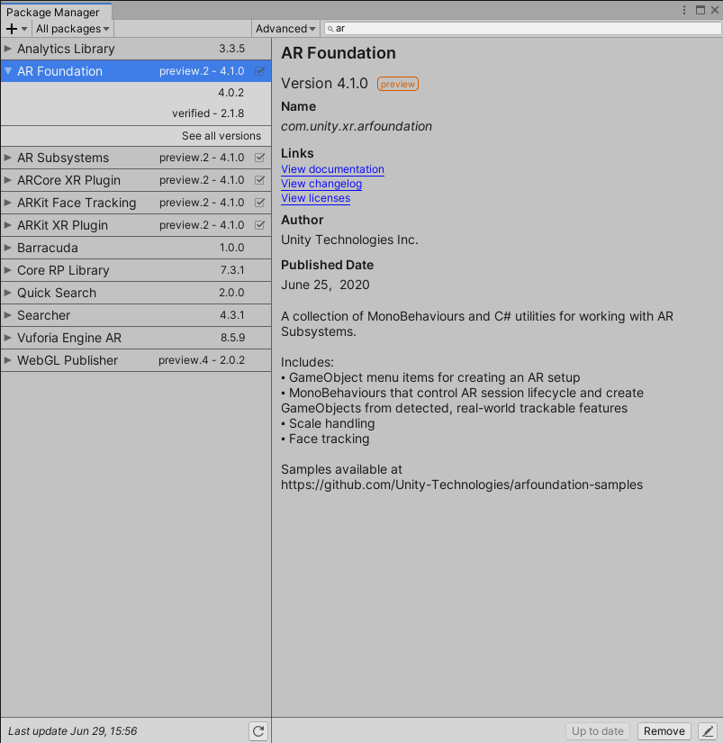
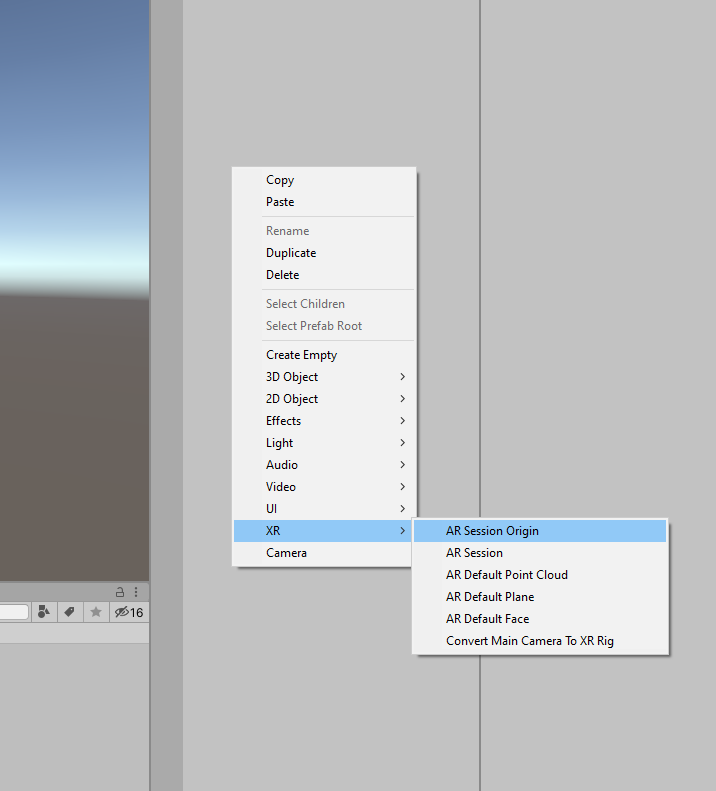
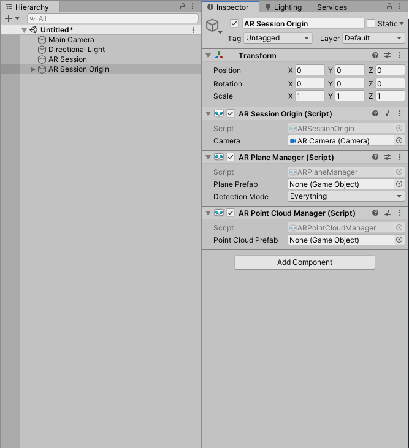
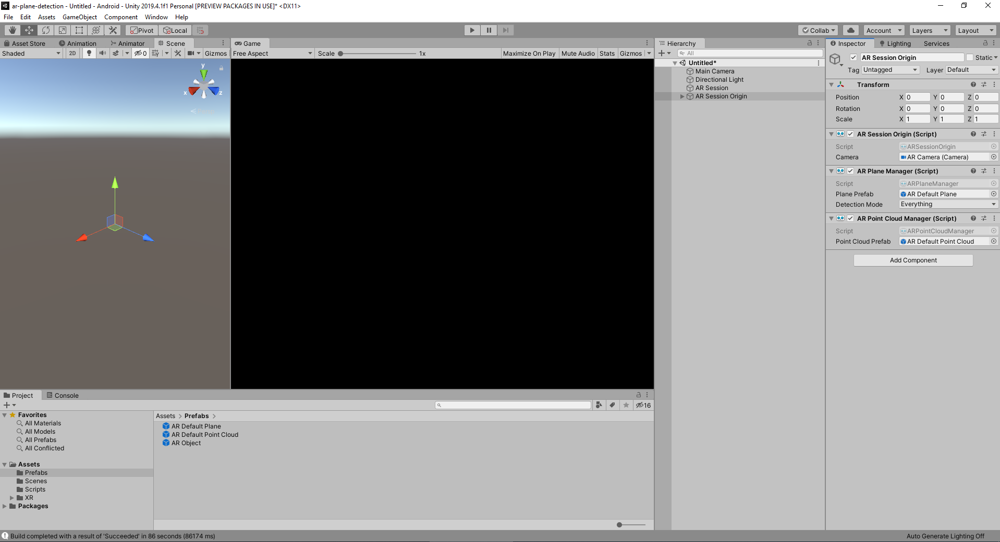
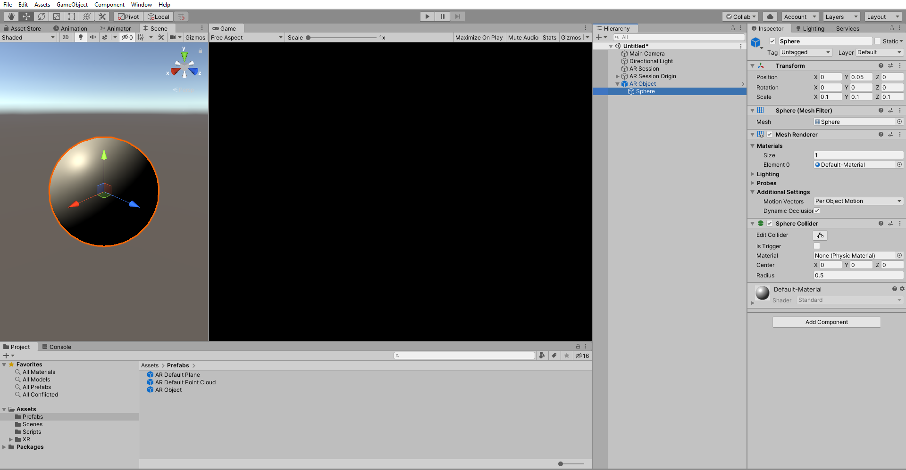
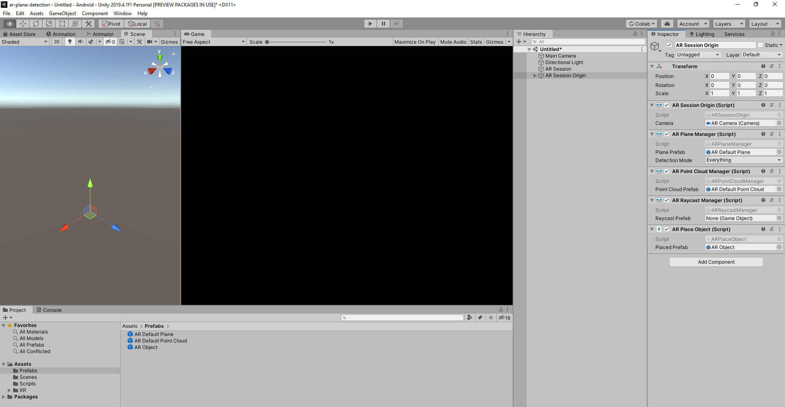

# `Unity AR Foundation Detect Plane And Place Object`
### Install AR Foundation / AR Core XR Plugin / AR Kit XR Plugin

Window > Package Manager, search for those pacakage and install it one by one
(Advanced > Show preview package and install preview.2-4.1.0)



### Add XR Object To Scene
Add Game Object > XR > AR Session <br>
Add Game Object > XR > AR Session Origin


Add Component AR Plane Manager<br>
Add Component AR Point Cloud Manager



Create Game Object > XR > AR Default Plane <br>
Create Prefabs folder and drag AR Default Plane to create new prefab, then
drag AR Default Plane prefab to AR Plane Manager > Plane Prefab

Do the same with Point Cloud <br>
Create Game Object > XR > AR Default Point Cloud, drag it to prefabas folder
then drag that prefab to AR Point Cloud Manager > Point Cloud Prefab



Next is create game object that will place on deteted plane with touch
First in Hierachy create new Empty Gameobject, then rename it to AR Object
next right click on it > 3D Object > Sphere, set sclae to (0.1, 0.1, 0.1)
and position (0, 0.05, 1)
Drag AR Object to prefab folder to create AR Object prefab



#### Let's do some coding 

Create new folder named it Scripts <br>
Create new C# script ARPlaceObject.cs, this script will handle the touch and place object on detected plane

 ```csharp
    if (Input.touchCount > 0)
            {
                var touch = Input.GetTouch(0);
    
                if (touch.phase == TouchPhase.Began)
                {
                    var touchPosition = Input.GetTouch(0).position;
                
                    List<ARRaycastHit> s_Hits = new List<ARRaycastHit>();
                
                    if (m_RaycastManager.Raycast(touchPosition, s_Hits, TrackableType.PlaneWithinPolygon))
                    {
                        // Raycast hits are sorted by distance, so the first one
                        // will be the closest hit.
                        var hitPose = s_Hits[0].pose;
                        Instantiate(m_PlacedPrefab, hitPose.position, hitPose.rotation);
                    }
                }
    
            }
```
Drag ARPlaceObject.cs to AR Session Origin in hierarchy, drag AR Object prefab from prefab folder to AR Place Object > Placed Prefab


* Remove Vulkan graphic in Player setting > Other Setting > Graphics APIs

Ready to build and test place some object on plane!
### Just clone this repo and try it your own!
